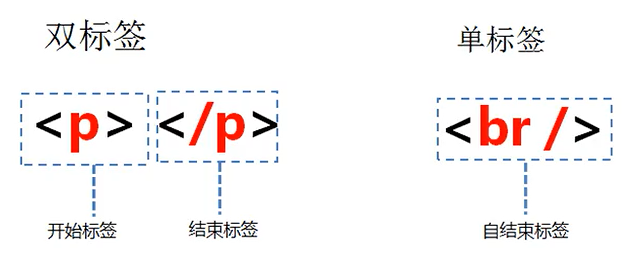
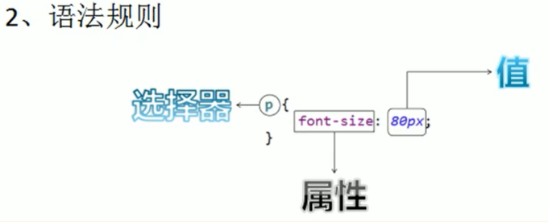

# HTML的标签介绍
* 标签的格式  
```html
    <标签名>封装的数据</标签名>  
```  
* 标签名大小写不敏感
* 标签拥有自己的属性  
i. 分为基本属性：bgcolor = "red" &#8195;&emsp;可以修改简单的样式效果  
ii. 时间属性：onclick="alert('您好！');"  &#8195;&emsp; 可以直接修改事件响应后的代码  
* 标签又分为，单标签和双标签  
i. 单标签格式：<标签名/>  
ii. 双标签格式：<标签名>。。。封装的数据。。。</标签名>  
  

### 标签的语法
* 标签不能交叉嵌套
* 标签必须正确关闭
* 属性必须要有值，属性值必须加引号
* 注释不能嵌套
### 常用标签
* 看W3CSchool
* 菜鸟教程
* div标签 默认独占一行
* span标签，长度是封装数据的长度
* p段落标签，默认会在段落的上方或下方各空出一行来（如果已有就不再空）
* form表单案例  
form标签就是表单  
为了格式更加好看  一般放在表格中  
-- [案例](./static_web/formDemo.html)   
-- input type=text  是文件输入框  value设置默认显示内容  
-- input type=password 是密码输入框 value设置默认显示内容  
-- input type=checkbox 是复选框 checked="checked"表示默认选中  
-- input type=reset 是重复按钮   value属性修改按钮上的文本  
-- input type=submit 是提交按钮 value属性修改按钮上的文本  
-- input type=button 是按钮    value属性修改按钮上的文本  
-- input type=file  是文件上传域  
-- input type=hidden    是隐藏域    当我们要发送某些信息，而这些信息，不需要用户参与，就可以使用隐藏域（提交的时候发送给服务器）  
select 标签是下拉列表框  
option标签是下拉列表框中的选项  select="select"设置默认选中  
textarea    表示多行文本输入框（起始标签和结束标签中的内容是默认值）  
&#8195;&emsp; rows属性设置可以显示几行的高度  
&#8195;&emsp; cols属性设置每行可以显示几个字符宽度
* form标签中的属性  
-- action属性设置提交服务器的地址  
-- method属性设置提交的方式GET(默认)或POST
* 表单提交的时候，数据没有发送给服务器的三种情况  
1、表单没有name属性值  
2、单选、复选、下拉列表中的option标签都需要添加value属性，以便发送给服务器  
3、表单项不在提交的form标签中
* GET请求的特点：  
1、浏览器地址栏中的地址是：action属性\[+?+请求参数]  
请求参数格式：name=value&name=value  
2、不安全  
3、它有数据长度的限制
* POST请求的特点是：  
1、浏览器地址栏只有action属性值  
2、相对于GET请求要安全  
3、理论上没有数据长度的限制
# CSS技术
* css是用于(增强)控制网页样式并允许将样式信息和网页内容分离的一种标志性语言

* 选择器：浏览器根据选择器觉得受css样式影响的html元素（标签）
* 属性：是你要改变的样式名，并且每一个属性都有一个值，属性和值被冒号分开，并由花括号包围，这样组成了一个完整的样式声明
* 多个声明：如果要定义不止一个声明，则需要用分号将每个声明分开。虽然最后一条声明的最后可以不加分号  
例如
```html
p{
    color:red;
    font-size:30px;
}
```
* css的注释：/\*注释内容\*/  
### css和html的结合使用
* 第一种：在标签的style属性上设置"key:value value value..."修改标签样式
```html
<div style="border: 1px solid red"></div>
```
* 这种方式的缺点  
1、如果标签多了、样式多了，代码量非常庞大  
2、可读性非常差  
3、css代码没有复用性可言
* 第二种：在head标签中，使用style标签来定义各种自己需要的css样式 
```html
<head>
    <meta charset="UTF-8">
    <title>cssDemo</title>
    <style type="text/css">
        div{
            border: 1px solid red;
        }
        span{
            border: 1px solid red;
        }
    </style>
</head>
``` 
-- [案例](./static_web/cssDemo.html)  
* 第二种方式的缺点  
1、只能在同一个页面内复用代码，不能在多个页面中复用css代码  
2、维护起来不方便，实际的项目中会有成千上万的页面，要到每个页面中去修改，工作量太大了  
* 第三种：把css样式写成一个单独的css文件，再通过link标签引入即可复用  
1、使用html的<link rel="stylesheet" type="text/css" href="./css1.css">标签 导入css样式文件  
2、创建CSS文件,css1.css [例如](./static_web/css1.css)  
```css
div{
    border: 1px solid red;
    color: blue;
    font-size: 30px;
}
span{
    border: 1px dashed red;
    color: yellow;
    font-size: 20px;
}
```
3、在html中引入css样式文件  [例如](./static_web/cssDemo2.html)  
```html
<head>
    <meta charset="UTF-8">
    <title>cssDemo</title>
    <link rel="stylesheet" type="text/css" href="./css1.css">
</head>
```
### CSS选择器
* 1、标签名选择器  
标签名选择器，可以决定哪些标签被动的使用这个样式
格式如下：
```html
标签名{
    属性: 值;
}
```
* 2、ID选择器  
可以让我们通过ID属性选择性的去使用这个样式 [案例](./static_web/cssDemo3.html) 格式如下
```html
#idID值{
    属性: 值;
}
```
* 3、class选择器（类选择器）  
可以通过class属性有效的去使用这个样式 [案例](./static_web/cssDemo4.html) 格式如下
```html
.class001{
    属性: 值；
}
```
* 4、组合选择器 将多种选择器组合在一起使用 [案例](./static_web/cssDemo5.html)，格式如下  
```html
选择器1,选择器2,选择器n{
    属性:值;
}
```  
### CSS常见样式
* 字体颜色  
颜色可以写颜色名称，black，blue，red等等，颜色也可以写RBG值和十六进制表示值，如rgb(255,0,0),#00F6DE,如果写十六进制值必须加#
```html
color: red;
```
* 宽度和高度  
可以写像素值：19px  
也可以写百分比值：20%
```html
width: 19px;
height: 20%;
```
* 背景颜色  
```html
background:#0F2D4C;
```
* 字体大小  
```html
font-size:20px;    字体大小
```
* 红色1像素实线边框  
```html
border: 1px solid red;
```
* DIV居中
```html
margin-left: auto;
margin-right: auto;
```
* 文本居中
```html
text-align: center;
```
* 超链接去除下划线
```html
text-decoration: none;
```
* 表格细线
```html
table {
    /*设置边框*/
    border: 1px solid black;
    /*将边框合并*/
    border-collapse: collapse;
}
tr, td {
    /*设置边框*/
    border: 1px solid black;
}
```
* 列表去除修饰
```html
ul {
    list-style: none;
}
```